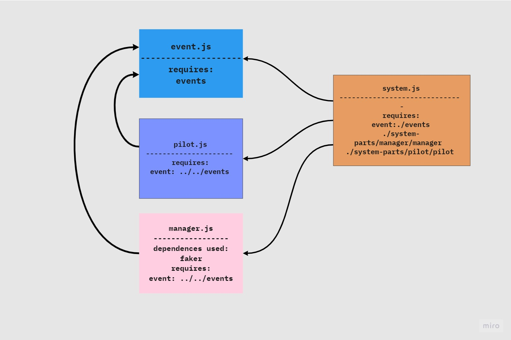

# airline-system

a control system for an Airline (for example Royal Jordanian Airlines) where it will keep tracking each flight status by contacting the pilot of that flight who in turn will inform the manager and the system when a flight took-off and arrived

## UML Diagram :

 

## [PR Link]()